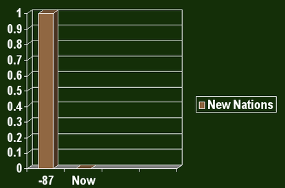

# Hi!

---

# Notes from UX Sketch Camp

- Talk -> never given

- how do I practice?

- New Idea...I dho'nt have practice

- Q: content tricky or stories?

- A: How do we know when design phase is done?

## Testing Pyramid
- 1 Acceptance test for every
- 10 Intergration tests, for every
- 100 Unit tests

Test driven engineering

What's the design version of the testing pyramid?
Sketching?
Common language of done
holy grail
looking at design as a series of experiments
more than just pretty pictures

75% spot-on
10% crazy
15% eh

---

---

results: 
CI for design

---

# Organizational Overview

---

# Summary

- New nation
- Civil war
- Dedicate field
- dedicated to unfinished work
- new birth of freedom
- Goverment not perish

---

With thanks to <http://norvig.com/Gettysburg/sld001.htm>
